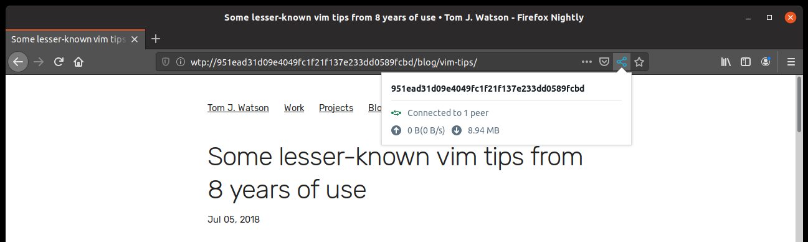
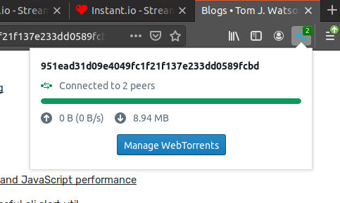
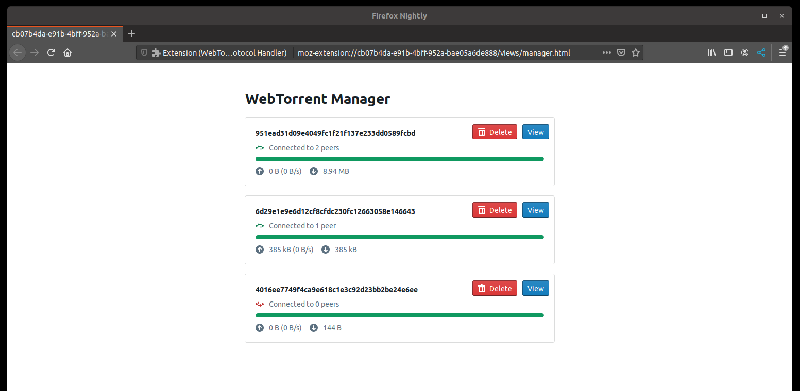

WebTorrent Protocol
===================

> Proof-of-concept distributed web powered by WebTorrents.

[](https://circleci.com/gh/tom-james-watson/workflows/wtp-ext/tree/master)


This is a proof-of-concept implementation of a distributed web powered by torrents. Instead of the traditional client-server model, websites are loaded directly from torrents, allowing websites to be hosted in a distributed and redundant manner.

This repository contains a web extension that, using [libdweb](https://github.com/mozilla/libdweb/), registers a protocol handler for a new `wtp://` WebTorrent Protocol. This extension allows you to open `wtp://` links as fully-functioning webpages, loaded directly from torrents, without needing to download and run any additional gateway software.



### Contents

- [How WTP works](#how-wtp-works)
  - [Domain Resolution](#domain-resolution)
- [Roadmap](#roadmap)
- [Running the WebTorrent Protocol Handler extension](#running-the-webtorrent-protocol-handler-extension)
- [Loading and serving websites over WTP](#loading-and-serving-websites-over-wtp)
- [Development](#development)

## How WTP works

The extension registers itself as a handler for the `wtp://` protocol, meaning requests to `wtp://` resources are intercepted and handled by the extension.

WTP URLs have the following structure:

`wtp://<domain or magnet hash>[/path/to/resource]`

For example, here is a link to a blog post on my personal website:

`wtp://tomjwatson.com/blog/vim-tips/`

The same page can also be accessed with the raw magnet hash:

`wtp://951ead31d09e4049fc1f21f137e233dd0589fcbd/blog/vim-tips/`

If the URL contains a domain, a DNS lookup over HTTPS will resolve it into a magnet hash ([see details](#domain-resolution)). The extension will parse the magnet hash of the resource and load the torrent using the [WebTorrent](https://github.com/webtorrent/webtorrent) library. Requests to resources are then translated directly into lookups for files in the loaded torrent. The data of found files are then streamed into the request response.

The torrents themselves need no special file structure - any static site folder will load just as it would over HTTP.

Visitors to the website also act as seeders, ensuring the website can scale as traffic grows. The number of seeders, along with stats on the state of the torrent download can be seen from the browser action popup:



Sites are automatically cached for 30 minutes, seeding to any other users that load the torrent during that time. Sites can also be permanently seeded, in which case they will be seeded constantly whenever the browser is open.

What torrents are currently cached or being seeded, along with associated stats, can be seen from the torrent management page, where torrents can also be manually removed:



### Domain resolution

As magnet hashes are not particularly human-friendly, WTP supports domain resolution over HTTPS.

In order to use your domain with `wtp://`, simply add a `TXT` DNS record with the format `wtpkey=<hash>`. For example, the below example will resolve the root domain and the `www` subdomain to `951ead31d09e4049fc1f21f137e233dd0589fcbd`.

```
NAME | TYPE | DATA
-----|------|------
@    | TXT  | wtpkey=951ead31d09e4049fc1f21f137e233dd0589fcbd
www  | TXT  | wtpkey=951ead31d09e4049fc1f21f137e233dd0589fcbd
```

## Roadmap

Here are the major pieces of functionality I would like to add:

* Add the ability to create and seed websites directly from the extension.
* Use the UDP/TCP libdweb APIs to enable interop with traditional torrent clients.

## Running the WebTorrent Protocol Handler extension

### Requirements

The extension depends on the experimental APIs provided by [libdweb](https://github.com/mozilla/libdweb/). As such, **[Firefox Nightly](https://www.mozilla.org/en-US/firefox/nightly/all/?q=English%20(US)) must be installed on your machine in order to run the extension**.

On mac and windows, simply install Firefox Nightly as normal and `web-ext` will handle the rest.

On linux, `firefox-nightly` must be available in your path. For example:

```
tar -xf firefox-66.0a1.en-US.linux-x86_64.tar.bz2
sudo mv firefox /opt/firefox-nightly
sudo ln -s /opt/firefox-nightly/firefox /usr/local/bin/firefox-nightly
```

### Running

The easiest way to run the extension at the moment is to clone the repository and load it with the follow npm scripts.

Install dependencies:

```
npm install
```

Bundle the extension's JavaScript:

```
npm run bundle
```

Launch Firefox Nightly with the extension loaded as a temporary addon:

```
npm start
```

### Running directly on Firefox Nightly

Alternatively, if you don't want to clone the whole repo, you can load the built extension as a temporary addon in Firefox Nightly.

**NOTE - you must launch Firefox Nightly with the content sandbox disabled**:

```
MOZ_DISABLE_CONTENT_SANDBOX=1 /path/to/firefox-nightly
```

On macOS, the bin is located at:

```
/Applications/Firefox\ Nightly.app/Contents/MacOS/firefox-bin
```

You can then load the temporary addon by going to `about:debugging#addons` and selecting `ext.zip`, which can be downloaded [here](https://github.com/tom-james-watson/wtp-ext/releases/latest).

## Loading and serving websites over WTP

Try loading my personal website:

`wtp://951ead31d09e4049fc1f21f137e233dd0589fcbd`

You can serve your own WTP website simply by seeding a webtorrent of static files. The easiest way for the purposes of testing is to use [instant.io](https://instant.io) to create a torrent with your files. Copy the "Torrent info hash" and open it as `wtp://<hash>`.

A more permanent method is to use the [webtorrent-hybrid](https://github.com/webtorrent/webtorrent-hybrid) CLI tool to seed your files:

```
webtorrent-hybrid seed <dir of static site>
```

You can then leave this running on a VPS, for example, to ensure your site is always seeded.

You can seed an existing torrent with:

```
webtorrent-hybrid <hash> --keep-seeding
```

## Development

Install dependencies:

```
npm i
```

Run webpack to create the extension JS bundle:

```
npm run watch
```

Open the web extension in a sandboxed Firefox Nightly instance:

```
npm start
```
